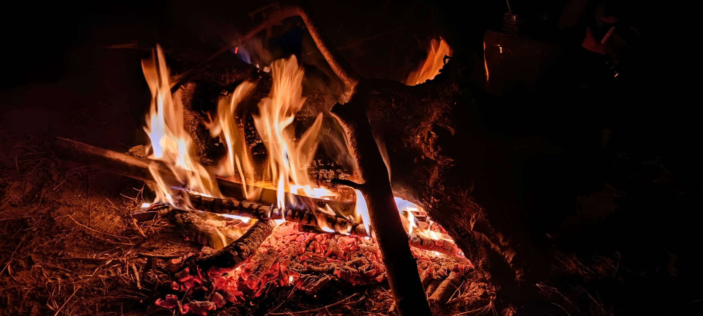
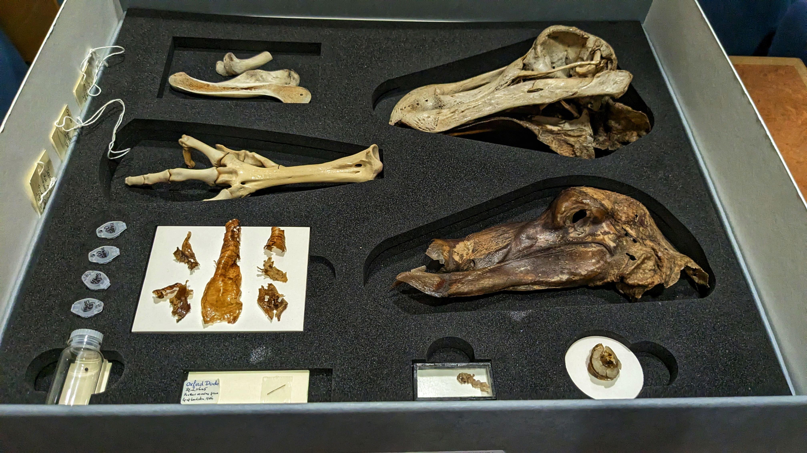

## Architecture & Urban

Imagine this is Beijing. What was once an industrial area has been transformed into an art campus after being abandoned. This is the 798 Art District (798艺术区). 

This is a photo of the Shanghai Normal University campus, this photo was taken during the 2022 Shanghai COVID lock down. I took the photo while we were going to get our daily COVID tests as requested by the university. They collected the samples at the football pitch, right next to where I lived -- a very small dormitory.  

## Nature & People

This photo was taken during 2022 Spring Festival. I think it was the lunar new year's eve. I was with two friends from my home town. 

## Science & Museums

This photo was taken during Dining with Dinosaur event hosted by Reuben College. I think this might be the last Dinging with Dinosaur in the Oxford University Museum of Natural History. In the picture is the Oxford Dodo, arguably one of the most important collections in the Museum.  